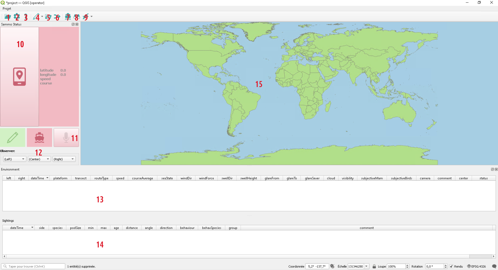
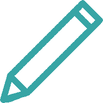
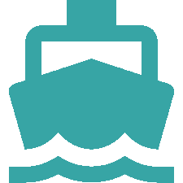
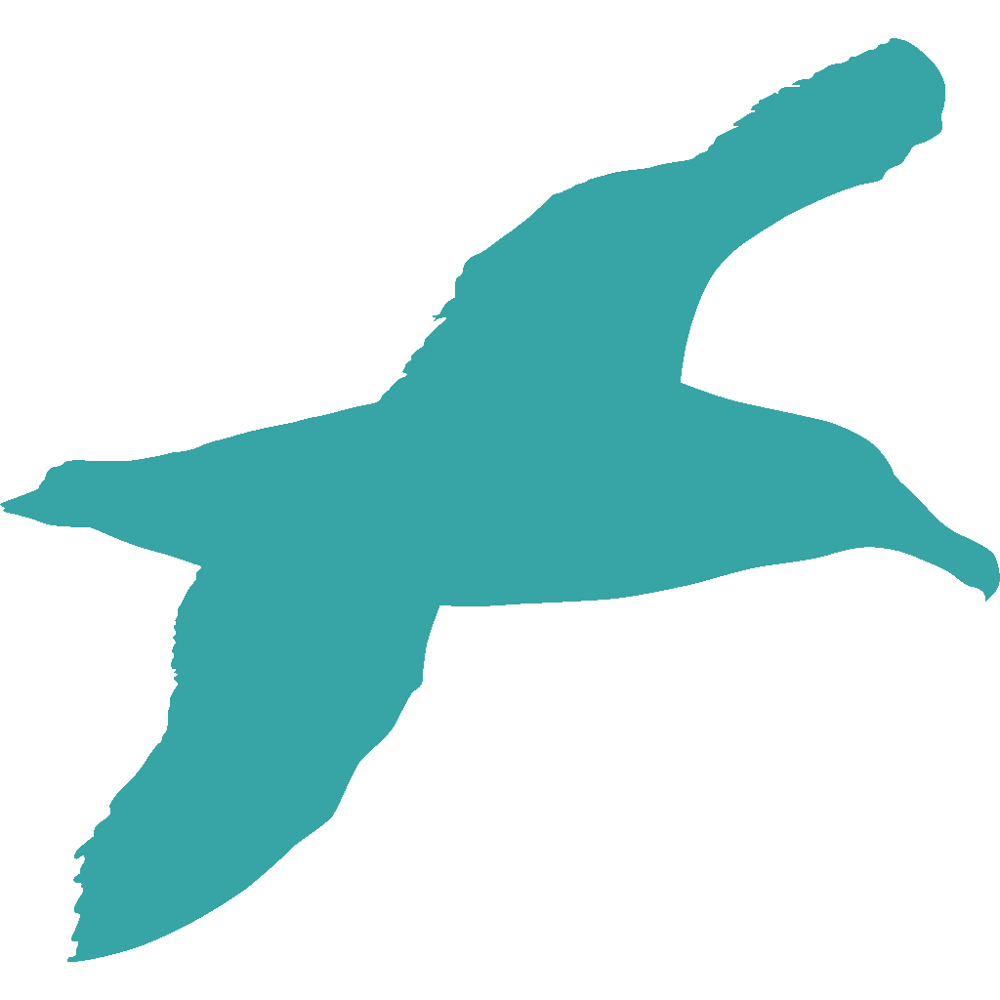
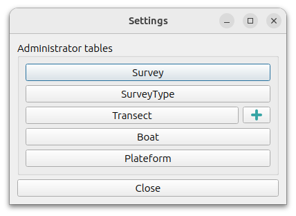
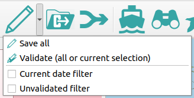
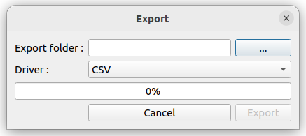
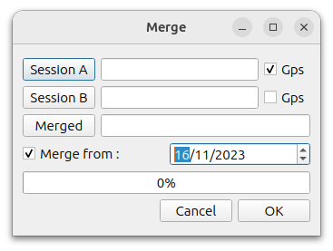
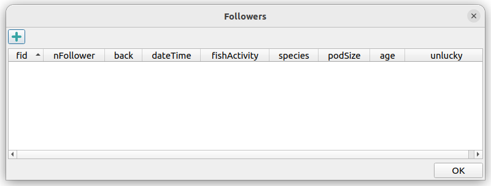
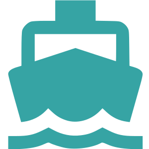

Interface
=========

The present capture shows the operator profile that includes only Sammo-boat features.

Toolbar
-------

Most Sammo-boat tools are available in the plugin toolbar.

.. _sessionbutton:

1 - |session| Session button
~~~~~~~~~~~~~~~~~~~~~~~~~~~~

This button allows to open an existing session or create a new session (cf. :ref:`session`)

.. _settingsbutton:

2 - |settings| Settings button
~~~~~~~~~~~~~~~~~~~~~~~~~~~~~~

This button allows to open the settings dialog, to configure administrators tables.

|

`Survey` button opens the single entity of the table which can be modified to
fulfill the session metadata. In the `Survey` table, `survey` attribute list
values come from the `SurveyType` table, `shipName` attribute list values come
from the `Boat` table.

`SurveyType`, `Transect`, `Boat` and `Plateform` buttons open their tables
dialog as each can contains more than one entity.

Especially for `Transect` table, it is possible to import a linear layer
(EPSG:4326). The imported layer must have the same attribute names as the
`Transect` table (transect,strateType,subRegion,length). Transect entity reference
will be available in the `Environment` table.

3 - |help| Documentation button
~~~~~~~~~~~~~~~~~~~~~~~~~~~~~~~

|

`Documentation` button opens the Sammo-boat documentation.

4 - |save| Validation button
~~~~~~~~~~~~~~~~~~~~~~~~~~~~

|

This button provides several features. The main action is used to save the
current session, including all layers and the project. This action can also be
done by using the ``Shift+s`` shortcut.

Futhermore the validation button includes the validation feature, that is used
to flag entities as verified. This feature should be used at the end of the
acquisition day, to check records without being in the rush. By default, it will
validate all records, after checking that environnement records are valids, but
user can also select entities in environment/sighting/follower tables to only
validate these particular entities.

At the end, there is also two filters that can be activated to filter
environment/sighting/follower tables. It can be useful to do the entity check.

5 - |export| Export button
~~~~~~~~~~~~~~~~~~~~~~~~~~

This button is used to export session into csv or gpkg files.

|

User have to mention the export folder and the driver.

A warning message will be displayed if an effort has no end datetime in the
environment layer.

6 - |merge| Merge button
~~~~~~~~~~~~~~~~~~~~~~~~

This button is used to merge session. It will open the following dialog :

|

If there is more than one observer on the boat, this feature can be used to merge
data from two distinct session. The environment/sighting/follower tables will be
merging, avoiding to copy identical entities captured on a previous day. Gps point
will be also decimated to keep only one record per minutes.

User can use the gps checkboxes to choose which session gps layer will be kept.

A warning message will be displayed if an effort has no end datetime in the
environment layer of one session.

7 - |environment| Environment button
~~~~~~~~~~~~~~~~~~~~~~~~~~~~~~~~~~~~

This button add a new environment record in the environment table. The focus is
set on the table (11) in order that the user can fulfill the attributes
(cf :ref:`environmenttable`). This action can also be done by using the ``Shift+e``
shortcut.

8 - |sighting| Sighting button
~~~~~~~~~~~~~~~~~~~~~~~~~~~~~~

This button add a new sighting record in the sighting table. The focus is
set on the table (12) in order that the user can fulfill the attributes
(cf :ref:`sightingtable`). This action can also be done by using the ``Space``
shortcut.

9 - |follower| Follower button
~~~~~~~~~~~~~~~~~~~~~~~~~~~~~~

This button is used to handle follower entities. The main action is used to add
new follower records by opening the follower dialog.

The |plus| button adds a new follower record. The followers added in the same
dialog will have the same timestamp.

This action can also be done by using the ``Shift+f`` shortcut.

The second action is used to open the follower table, so that user can check
records before the validation.

Status Panel
------------

10 - GPS button
~~~~~~~~~~~~~~

The GPS button is used to enable/disable the GPS. If no GPS is found, a message
box will appear to warn the user. Otherwise |gps_ko| will turn into |gps_ok|.

The GPS infos are displayed aside the button. Futhermore, a new gps entity is
created per minut.

11 - Microphone button
~~~~~~~~~~~~~~~~~~~~~~

By adding a environment/sighting/follower entity, the plugin starts recording.
User will notice it by seeing the |record_ko| turning into |record_ok|.
Each entity will be attached with its sound record. By default the record lasts
one minute. If user wants to short it, he can click on the |record_ok| button
to turn it into |record_ko|.

12 - Observer selection
~~~~~~~~~~~~~~~~~~~~~~~

Three combo box are available to select which observer are present on left, center
and right side. The available value are generated from the observer table.

When the operator adds a new effort entity in the environment layer, the left/center/right
fields will be populated from the current values in these combo boxes.

If needed, these values can be modified by using the "Duplicate or change current feature"
action.

Tables and map
--------------

.. _environmenttable:

11 - Environment table
~~~~~~~~~~~~~~~~~~~~~~

The environment table is used to modify environment entity attributes. Most
attributes are duplicated from the previous entity.

Environment entity describes environmental variables during the session.
To keep trace of different routes, according their ``routeType`` attribute.
A status will be assigned automatically to each entity.

Only the ``Begin`` status entity will be created by the operator. Entities with
``End`` status will be created only on export.

.. _sightingtable:

12 - Sighting table
~~~~~~~~~~~~~~~~~~~~

The sighting table is used to modify sighting entity attributes.
Sighting entity describes an observation made by the operator.

13 - Map canvas
~~~~~~~~~~~~~~~

User can follow the ongoing session on the map canvas. The following tables are
displayed:

- world (as background map)
- |gps_symbol| gps
- |transect_symbol| transect
- |environment_symbol| environmenent 
- |sighting_symbol| sighting 
- |follower_symbol| follower 
